<!-- ══════════════════════════════════════════════════════════════════ -->
<!--        HARISH AMEER — GITHUB PROFILE · ULTIMATE EDITION          -->
<!--        Features: Capsule Header, HUD Banner, Typing SVG,         -->
<!--        Trophies, Stats, Streak, Activity Graph, Snake,           -->
<!--        Random Quotes, Skill Bars, 3D Contributions,              -->
<!--        Animated Badges, Collapsible Sections, Wave Footer        -->
<!-- ══════════════════════════════════════════════════════════════════ -->

<!-- ① CAPSULE RENDER ANIMATED WAVE HEADER -->


<!-- ② CUSTOM HUD BANNER (no duplicate name — just the H·A monogram) -->
<div align="center">

</div>

<!-- ③ ANIMATED TYPING SVG -->
<div align="center">

</div>

<br/>

<!-- ④ QUICK CONTACT BADGES -->
<div align="center">

[](https://haris1731.github.io/portfolio)
[](mailto:harisahmed1731@gmail.com)
[](tel:+918696746270)
[](https://github.com/haris1731)

</div>

---

<!-- ⑤ GITHUB TROPHIES — auto-generated achievements -->
<div align="center">

### `🏆 $ ./achievements.sh`

[](https://github.com/ryo-ma/github-profile-trophy)

</div>

---

<!-- ⑥ WHO AM I — terminal style -->
## `$ whoami --verbose`


```yaml
╔══════════════════════════════════════════════════════════╗
║  Name        →  Harish Ameer                             ║
║  Role        →  MIS Analyst @ Creadgenics                ║
║  Location    →  Delhi, India 🇮🇳                          ║
║  Experience  →  2+ Years in Data & MIS Operations        ║
║  Education   →  BSc (PMCs) · MGS University              ║
║  Focus       →  Data · Automation · Intelligence Systems ║
║  Status      →  ● Open to Opportunities                  ║
║  Mission     →  Turn messy data → powerful decisions     ║
║  Phone       →  +91 8696746270                           ║
║  Email       →  harisahmed1731@gmail.com                 ║
╚══════════════════════════════════════════════════════════╝
```

<!-- ⑦ RANDOM DEV QUOTE — changes every single page refresh -->
<div align="center">

> 💬 **Quote of the moment** *(refreshes every visit)*

[](https://github.com/piyushsuthar/github-readme-quotes)

</div>

---

<!-- ⑧ SKILL BARS WITH VISUAL PROGRESS -->
## `$ cat skills.json`

<table width="100%">
<tr>
<td width="50%" valign="top">

**📊 Data & Analytics**
```
Excel / VBA          ████████████████████ 95%
Google Sheets        ████████████████████ 90%
Power BI             ████████████████░░░░ 80%
SQL                  ███████████████░░░░░ 75%
Data Visualization   ████████████████████ 88%
```

</td>
<td width="50%" valign="top">

**⚙️ MIS & Operations**
```
Dashboard Creation   ████████████████████ 92%
Report Automation    ████████████████████ 95%
Payroll / HR Ops     █████████████████░░░ 85%
Data Management      ████████████████████ 90%
Process Automation   █████████████████░░░ 87%
```

</td>
</tr>
</table>

<!-- ⑨ TECH BADGE GRID -->
<div align="center">

**── Core Tools ──**


**── Automation & Cloud ──**


**── Specializations ──**


</div>

---

<!-- ⑩ EXPERIENCE — collapsible sections -->
## `$ cat experience.log`

<details>
<summary><b>🟢 Creadgenics — MIS Analyst · Jan 2025 → Present &nbsp;[CLICK TO EXPAND]</b></summary>
<br/>

```
┌─────────────────────────────────────────────────────────────────┐
│  🚀 Building Creadgenics' data backbone from the ground up      │
├─────────────────────────────────────────────────────────────────┤
│  ► End-to-end MIS operations — collect, structure, analyse      │
│  ► Live KPI dashboards giving leadership real-time pulse        │
│  ► Automated data pipelines replacing hours of manual work      │
│  ► Advanced Excel — dynamic arrays, Power Query, macros         │
│  ► Standardising reporting templates & training teams           │
└─────────────────────────────────────────────────────────────────┘
```

</details>

<details>
<summary><b>⚡ DKC Exports — MIS Executive · Jul 2024 → Jan 2025 &nbsp;[CLICK TO EXPAND]</b></summary>
<br/>

```
┌─────────────────────────────────────────────────────────────────┐
│  ⚡ Reduced reporting time by 50% through automation            │
├─────────────────────────────────────────────────────────────────┤
│  ► Advanced Excel — dashboards, pivots, macros, full VBA        │
│  ► Google Sheets automation via Apps Script                     │
│  ► Real-time dashboards with automated email triggers           │
│  ► Migrated Excel → Google Sheets for cross-team collab         │
└─────────────────────────────────────────────────────────────────┘
```

</details>

<details>
<summary><b>📋 Easy Source HR — Client Servicing · Jan 2024 → Jun 2024 &nbsp;[CLICK TO EXPAND]</b></summary>
<br/>

```
┌─────────────────────────────────────────────────────────────────┐
│  ► CTC structuring, salary computation, payroll cycles          │
│  ► TDS certificates, attendance, overtime, F&F settlements      │
│  ► Data collection protocols for high-profile clients           │
└─────────────────────────────────────────────────────────────────┘
```

</details>

---

<!-- ⑪ CERTIFICATIONS TABLE -->
## `$ ls -la certifications/`

<div align="center">

| 🏅 | Certificate | Issuer | Status | Year |
|:--:|:-----------|:-------|:------:|:----:|
| 🏆 | **SQL — Intermediate** | HackerRank | ✅ Verified | 2024 |
| ☁️ | **AWS Cloud Practitioner (CCP)** | Udemy | ✅ Certified | 2024 |
| 📊 | **Data Analyst Certification** | Udemy | ✅ Certified | 2024 |
| 📈 | **Advanced Excel · VBA · Dashboards** | IICS | ✅ Certified | 2023 |

</div>

---

<!-- ⑫ PROJECTS — collapsible -->
## `$ ls projects/ --detail`

<details>
<summary><b>📊 PROJECT 01 · Creadgenics Analytics Hub · [CURRENT LIVE]</b></summary>
<br/>

```
Tech Stack  →  Excel · Power Query · Automation · KPI Tracking
Status      →  ● Live & Active
Impact      →  Centralized MIS system connecting sales, ops & finance
```
</details>

<details>
<summary><b>📈 PROJECT 02 · Real-Time Export MIS Dashboard</b></summary>
<br/>

```
Tech Stack  →  Excel · VBA · Pivot Tables · Charts
Status      →  ✅ Complete
Impact      →  Automated shipment & inventory tracking with email triggers
```
</details>

<details>
<summary><b>💰 PROJECT 03 · HR Payroll Automation System</b></summary>
<br/>

```
Tech Stack  →  Google Sheets · Apps Script · Gmail API
Status      →  ✅ Complete
Impact      →  Auto salary slips · TDS computation · email distribution
```
</details>

<details>
<summary><b>📉 PROJECT 04 · Client Data Analytics Portal</b></summary>
<br/>

```
Tech Stack  →  Power BI · DAX · SQL · Data Modeling
Status      →  ✅ Complete
Impact      →  Interactive dashboards for client performance metrics
```
</details>

---

<!-- ⑬ GITHUB STATS -->
## `$ ./github_stats.sh --full`

<div align="center">


</div>

<!-- ⑭ STREAK STATS -->
<div align="center">

[](https://git.io/streak-stats)

</div>

---

<!-- ⑮ ACTIVITY GRAPH — wave graph of contributions -->
## `$ render --activity-graph`

<div align="center">

[](https://github.com/ashutosh00710/github-readme-activity-graph)

</div>

---

<!-- ⑯ SNAKE ANIMATION -->
## `$ snake --eat-contributions --dark`

<div align="center">

</div>

---

<!-- ⑰ EDUCATION -->
## `$ cat education.log`

```
┌──────────────────────────────────────────────────────────────┐
│  🎓  BSc (PMCs)  ·  MGS University  ·  2020 — 2023          │
│  📚  Science XII  ·  Sun Bright School  ·  2019 — 2020       │
│  🏫  Intermediate X  ·  Sun Bright School  ·  2017 — 2018    │
└──────────────────────────────────────────────────────────────┘
```

---

<!-- ⑱ FUN FACTS — python code style -->
## `$ python3 fun_facts.py`

```python
harish = {
    "superpower"  : "Turn 3-hour manual reports → 3-second automated clicks",
    "philosophy"  : "Data without context is just noise",
    "best_work"   : "Dashboard your CEO reads in 10 seconds flat",
    "secret"      : "BSc Science → Data Analyst · curiosity > credentials",
    "obsession"   : "Building systems that make organizations smarter",
    "quote"       : "I don't just report WHAT happened — I explain WHY"
}

for key, value in harish.items():
    print(f"  → {key.upper():12} : {value}")

# OUTPUT:
#   → SUPERPOWER   : Turn 3-hour manual reports → 3-second automated clicks
#   → PHILOSOPHY   : Data without context is just noise
#   → BEST_WORK    : Dashboard your CEO reads in 10 seconds flat
#   → SECRET       : BSc Science → Data Analyst · curiosity > credentials
#   → OBSESSION    : Building systems that make organizations smarter
#   → QUOTE        : I don't just report WHAT happened — I explain WHY
```

---

<!-- ⑲ CONTACT -->
## `$ ping connect.harish --all`

<div align="center">

[](https://haris1731.github.io/portfolio)
[](mailto:harisahmed1731@gmail.com)
[](tel:+918696746270)

</div>

---

<!-- ⑳ CLOSING QUOTE -->
<div align="center">

```
╔═══════════════════════════════════════════════════════════════╗
║                                                               ║
║   "Every number tells a story.                                ║
║    My job is to make sure the right people hear it."          ║
║                                       — Harish Ameer          ║
╚═══════════════════════════════════════════════════════════════╝
```


</div>

<!-- ㉑ ANIMATED WAVE FOOTER -->

